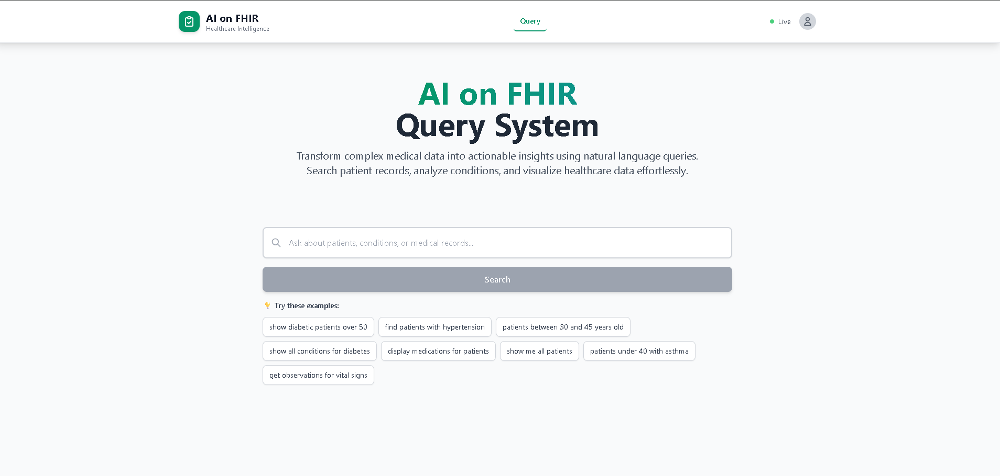
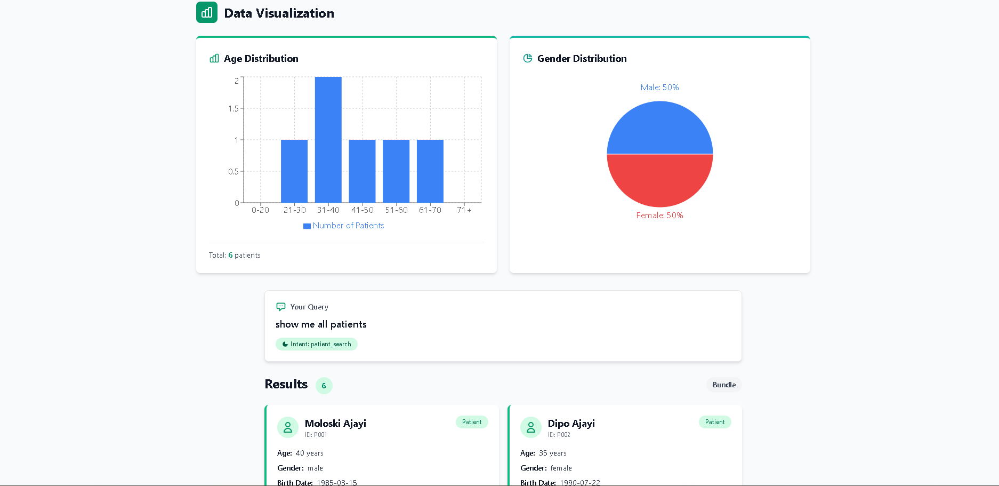
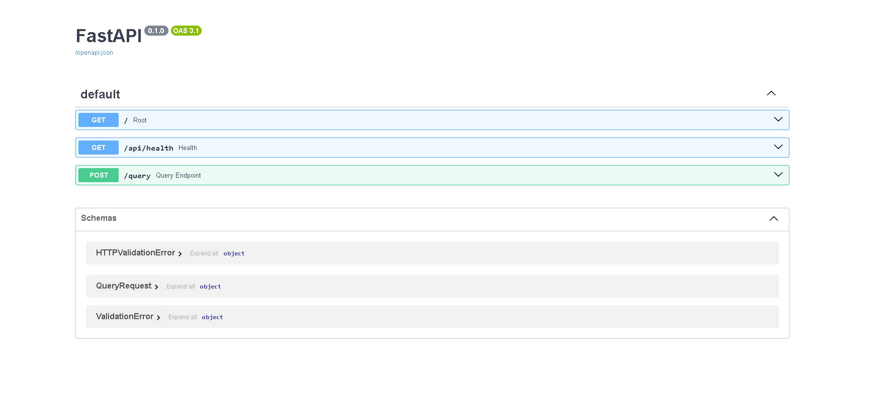

# AI on FHIR Query System with OAuth 2.0 + SMART on FHIR

Hello Emmanuel,

This is my take on building a natural language interface for FHIR healthcare data with secure authentication. The goal was to let people query patient records and medical conditions without writing complex database queries — just using plain English, while maintaining proper healthcare security standards.

## 🔗 Quick Links

- 🖥️ [Frontend Live Demo](https://onye-test.vercel.app)
- 🧠 [HIPAA Compliance Plan (PDF)](./HIPAA_Compliance_and_Security_Plan_by_Moyo.pdf)
- 🐳 [Docker Guide](./docker_guide.md)
- 🔐 [Auth0 Setup Guide](./AUTH0_SETUP.md)

## 🔒 New: Authentication & Authorization

I've implemented **OAuth 2.0 with SMART on FHIR** authentication for enterprise-grade security:

- **OAuth 2.0 Flow**: Secure authentication using Auth0 as identity provider
- **SMART on FHIR Scopes**: Healthcare-specific permissions (`patient/*.read`, `user/*.read`)
- **JWT Validation**: Backend validates tokens with Auth0 JWKS for security
- **Role-Based Access**: Users see only data they're authorized to access
- **Session Management**: Secure session handling with NextAuth.js

### Authentication Features
- 🔐 Login/logout with Auth0
- 👤 User profile display with permissions
- 🎯 Scope-based data filtering (patients only see their authorized data)
- 🔑 JWT bearer token authentication for API calls
- 🚫 Protected routes and endpoints
- ⚡ Automatic token refresh

See [AUTH0_SETUP.md](./AUTH0_SETUP.md) for complete setup instructions.

## 🔗 Quick Links

- 🖥️ [Frontend Live Demo](https://onye-test.vercel.app)
- 🧠 [HIPAA Compliance Plan (PDF)](./HIPAA_Compliance_and_Security_Plan_by_Moyo.pdf)
- 🐳 [Docker Guide](./docker_guide.md)

## Screenshots

### Main Interface

*Natural language query input with pre-built suggestions*

### Query Results with Visualizations

*Patient data displayed with interactive charts showing age distribution, gender breakdown, and condition statistics*

### API Documentation

*FastAPI Swagger UI for backend endpoints*

## What It Does

Type something like "show me patients with diabetes" and the system:
1. Processes your query using NLP (spaCy)
2. Figures out what you're looking for
3. Filters the FHIR data accordingly
4. Shows you results with charts and visualizations

I deployed the frontend to Vercel and Dockerized everything so you can spin it up locally in seconds.

## Quick Setup

### Option 1: With Authentication (Full Experience)

1. **Set up Auth0** (see [AUTH0_SETUP.md](./AUTH0_SETUP.md) for detailed guide):
   - Create Auth0 account and application
   - Configure SMART on FHIR scopes
   - Set up API with JWT validation

2. **Configure Environment**:
   ```bash
   # Copy environment templates
   cp backend/.env.example backend/.env
   cp frontend/src/.env.local.example frontend/.env.local
   
   # Fill in your Auth0 values in both .env files
   ```

3. **Run with Docker**:
   ```bash
   git clone https://github.com/Moyowalker/onye-test.git
   cd onye-test
   docker-compose up --build
   ```

### Option 2: Quick Demo (No Auth Setup)

For a quick demo without authentication setup:
```bash
git clone https://github.com/Moyowalker/onye-test.git
cd onye-test
# Comment out authentication middleware in backend/main.py
docker-compose up --build
```

### Access Points:
- Frontend: http://localhost:3000
- Backend API: http://localhost:8000
- API docs: http://localhost:8000/docs

See [docker_guide.md](./docker_guide.md) for more detailed Docker instructions.

### Local Development:

**Backend:**
```bash
cd backend
python -m venv venv
source venv/bin/activate  # Windows: venv\Scripts\activate
pip install -r requirements.txt
python -m spacy download en_core_web_sm
uvicorn main:app --reload
```

**Frontend:**
```bash
cd frontend
npm install
npm run dev
```

## Tech Stack

- **Backend**: FastAPI + spaCy for NLP + Python 3.11
- **Frontend**: Next.js 14 + TypeScript + Tailwind
- **Authentication**: OAuth 2.0 + SMART on FHIR via Auth0
- **Security**: JWT validation + scope-based authorization
- **Deployment**: Docker + Vercel
- **Data**: FHIR R4 compliant mock resources

## Try These Queries

- "Show me all patients"
- "Find patients with diabetes" 
- "Show patients older than 50"
- "List all conditions"

## What I Focused On

**Core Functionality**: Got the NLP processing working smoothly with spaCy. The query parser can handle different phrasings and extract entities like age, conditions, and gender filters.

**FHIR Standards**: Made sure the data follows FHIR R4 resource structure. In a real scenario, this would connect to an actual FHIR server, but for now I'm using mock data that matches the spec.

**DevOps**: Dockerized both services with proper health checks, non-root users, and multi-stage builds. Everything orchestrates through docker-compose with a custom network.

**UI/UX**: Kept it clean and functional. Added visualizations (charts for age distribution, gender breakdown, condition stats) using Recharts. Went with an emerald/teal theme instead of the typical blue.

## What I'd Improve With More Time

1. **Real FHIR Integration**: Hook this up to an actual FHIR server (HAPI FHIR or Azure FHIR service) instead of mock data

2. **Enhanced SMART Authorization**: Implement patient selection workflow and launch context for full EHR integration

3. **Better NLP**: The current parser works but could be smarter. Would love to add support for complex queries like "male patients over 60 with diabetes OR hypertension"

4. **Advanced Auth Features**: Add user management, admin roles, API key authentication for service-to-service calls

5. **Testing**: Need unit tests for the NLP parser, authentication middleware, and integration tests for the API endpoints

6. **Caching**: Redis layer for frequently accessed FHIR resources and JWT validation caching

7. **Error Handling**: More graceful error messages and retry logic for Auth0 failures

8. **Observability**: Proper logging (structured JSON logs) and maybe OpenTelemetry for tracing

9. **Performance**: Database integration with proper indexing for large FHIR datasets

## Notes

- The backend runs on port 8000, frontend on 3000
- CORS is configured for localhost:3000
- Check out [docker_guide.md](./docker_guide.md) for deployment details
- HIPAA considerations are documented in the [PDF compliance plan](./HIPAA_Compliance_and_Security_Plan_by_Moyo.pdf)

---

Thanks for reviewing my submission.

I really enjoyed building this — especially the challenge of bridging NLP and FHIR in a way that feels natural and useful.

— Moyosore Ajayi