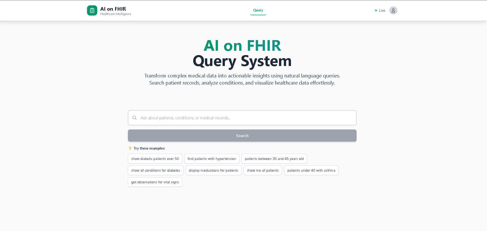

# Frontend - Next.js + TypeScript

This is the web interface where users can type natural language queries and see results with visualizations.

## Screenshots

### Query Interface


### Results & Visualizations


## Running Locally

```bash
# Install dependencies
npm install

# Start dev server
npm run dev
```

Open http://localhost:3000

Make sure the backend is running on port 8000, otherwise you'll get connection errors.

## What's Inside

**src/app/page.tsx** - Main page with query input and results display
**src/components/QueryInput.tsx** - Text input with suggested queries
**src/components/QueryResults.tsx** - Displays patient/condition cards
**src/components/DataVisualization.tsx** - Charts using Recharts

## Design Choices

The layout is pretty straightforward:
- Query input at the top with suggestions
- Charts show up first (age distribution, gender breakdown, conditions)
- Individual result cards below

I'm using Tailwind for styling because it's fast and keeps the components self-contained. No separate CSS files to hunt through.

## What I'd Improve

1. **Better loading states**: Right now it just shows "Processing..." - could add skeleton screens

2. **Error handling**: Need more specific error messages. If the backend is down, tell the user that instead of a generic error

3. **Query history**: Save recent queries in localStorage so users can revisit them

4. **Export results**: Add a button to download results as CSV or PDF

5. **Responsive charts**: The Recharts work okay on mobile but could be better optimized for small screens

6. **Accessibility**: Need proper ARIA labels and keyboard navigation for the query suggestions

7. **State management**: Right now everything is in page.tsx useState. For a bigger app, I'd use Zustand or React Query

## Tech Used

- Next.js 14 (App Router)
- TypeScript
- Tailwind CSS
- Recharts for visualizations

The app is deployed on Vercel which was super easy - just connected the GitHub repo and it auto-deploys on anytime i push to the repo.

## Notes

The API URL is hardcoded to localhost:8000 for local dev. For production, you'd want to use an environment variable (NEXT_PUBLIC_API_URL) pointing to wherever the backend is hosted.
